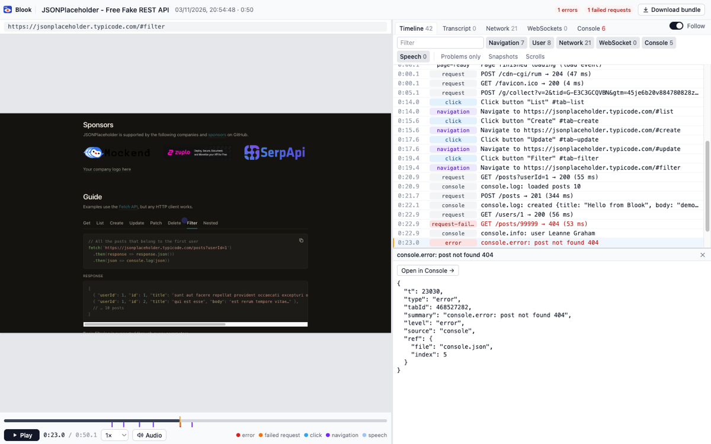
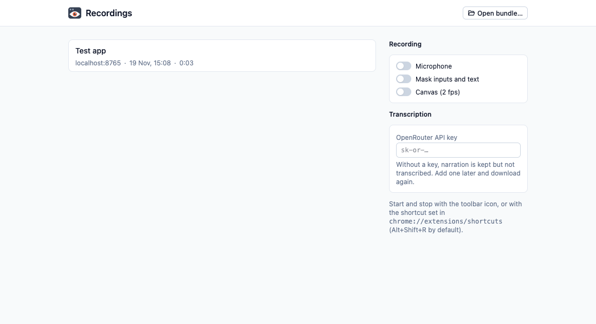

# Blook

Blook is a Chrome extension that records what happens in your browser while you talk, so a person or a coding agent can replay it later.

Website, and a viewer that opens a recording in your browser: https://cyrillbrito.github.io/blook/

<a href="https://chromewebstore.google.com/detail/njijkneplfdknfbmbokldfpbdhgpppbi"></a>



## What it captures

- The page itself, with your mouse, clicks, scrolls and typing
- The network requests and the console
- Your voice, transcribed word by word

Everything lines up in time, and a recording is one ZIP file on your computer. Nothing is uploaded, and there are no accounts.

## Install

Add Blook from the [Chrome Web Store](https://chromewebstore.google.com/detail/njijkneplfdknfbmbokldfpbdhgpppbi), pin it in the toolbar, and click it to open its menu.

## Record

1. On the page you want to record, click the Blook icon and press **Start recording**, or press Alt+Shift+R.
2. Use the page and talk. Point at things with the mouse. A pill at the bottom of the page shows the time and the Stop button. Drag it anywhere it isn't in the way; it stays out of the recording.
3. Press **Stop** on the pill, then **Download** for the ZIP. Every recording is also in the Blook menu and in **All recordings**.

Change the shortcut in `chrome://extensions/shortcuts`.

The first time, Chrome asks for the microphone. Pick **Allow while visiting the site**, so it only asks once.

## Voice transcription (optional)

To get your voice transcribed, click the gear icon in the Blook menu (it opens **Settings**) and paste an [OpenRouter API key](https://openrouter.ai/keys). Without one, the recording still keeps your voice, and it can be transcribed later.



## Open a recording

Click **Open bundle…** in the Blook menu, or drop the ZIP on the [viewer on the website](https://cyrillbrito.github.io/blook/viewer/).

In the viewer, Space plays and pauses, and ←/→ step 1 second (5 with Shift). In a list, ↑/↓ move from one entry to the next, and the replay follows.

## For coding agents

To let your coding agent read recordings, run this once on macOS or Linux:

```sh
curl -fsSL https://raw.githubusercontent.com/cyrillbrito/blook/main/install.sh | sh
```

Then give your agent a recording's ZIP.
